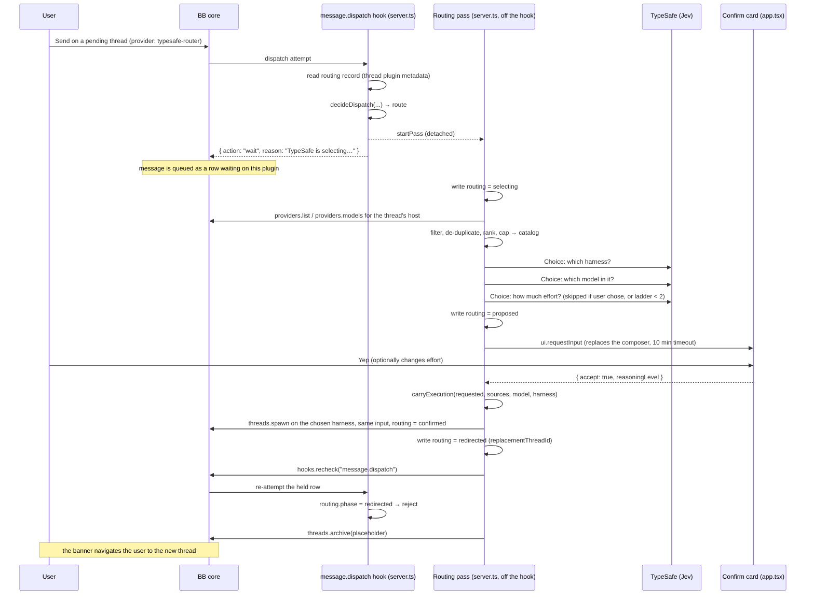

# Architecture

## The problem the shape solves

Two BB facts set the shape of everything here:

1. **A thread's harness is fixed once it runs.** Follow-ups, steers, and
   retries all go to the harness the thread started on. So routing can only
   happen on the first message, and a proposal that changes the harness has to
   *move the message to a new thread* rather than change this one.
2. **The New Thread page will not enable Send without a provider and a model.**
   Routing cannot run before Send, so something selectable has to exist before
   a harness has been chosen.

The plugin is the smallest set of parts that satisfies both: a picker row that
can be selected but never runs, a hook that holds the first message, a routing
pass that runs off the hook, and a confirmation card.

## The pieces

```
package.json  bb.server → server.ts      the backend: settings, hook, routing pass, RPC
              bb.host   → host.ts        the provider bridge for the picker row
              bb.app    → app.tsx        the composer banner, confirm card, settings section
              bb.skills → skills/        what agents are told about routing
```

| Piece | File | What it owns |
| --- | --- | --- |
| Picker row | `lib/provider.ts` | The provider id `typesafe-router`, its one model `route`, and `isRoutableProviderId()` — the single predicate that keeps the row out of every catalog and every release. |
| Bridge | `lib/provider-bridge.ts`, `host.ts` | The JSON-RPC handshake BB requires before it will list a provider. Answers `initialize`, `model/list`, `provider/health`, `thread/start`, `thread/stop`; refuses `thread/resume` and `turn/start`. |
| Policy | `lib/policy.ts` | Pure decision: given the facts of a dispatch and the thread's routing record, answer `route`, `wait`, `proceed`, or `reject`. Also the routing record type and its parser. |
| Catalog | `lib/catalog.ts` | Pure: the harness filter, family de-duplication, ranking by task axis, and the eight-model cap. |
| Knowledge | `lib/knowledge.ts`, `lib/task-axis.ts`, `lib/family.ts`, `datasets/` | Authored capability cards, vendored benchmark percentiles, the local task classifier, and family-key normalisation. |
| Router | `lib/router.ts` | The three TypeSafe Choice calls against an injectable client, with fallbacks. |
| Execution | `lib/execution.ts` | Pure: which of the user's effort / tier / permission choices can follow the message to the chosen harness. |
| Preferences | `lib/preferences.ts`, `lib/preference-store.ts` | The routing switch and harness allow-list, stored in `bb.storage.kv`, with a one-time migration from legacy settings. |
| Server | `server.ts` | Wiring: registers the provider, defines the API-key setting, installs the hook, runs the pass, spawns the replacement thread, serves RPC. |
| App | `app.tsx`, `components/settings-controls.tsx` | The composer banner, the confirmation card (a pending-interaction renderer), and the settings section. |

`lib/` is pure and fully tested without the network. `server.ts` gathers live
facts and hands them to `lib/`; it is the only file that talks to BB's SDK.

## A first message, end to end



The same-harness path (the proposal keeps the harness the thread already had)
updates the model and effort on the thread in place and lets the held message
through instead of spawning. It is unreachable: routing only runs for a thread
on the picker row, and the picker row is never a candidate, so every proposal
changes the harness. It is kept as cheap insurance, in the same spirit as the
picker-row guard in `apply()`.

## The three rules

Everything else is detail on top of these.

**A turn never starts on the picker row.** Enforced in three places that do not
depend on each other: the bridge refuses `turn/start`; the catalog builder
drops the row before TypeSafe sees it; and `decideDispatch()` in `lib/policy.ts`
turns *any* `proceed` on the row into a `reject`, applied over the whole
decision rather than inside a branch, so a future branch cannot forget it.

**Only a first message sent on the picker row is routed.** Routing is opt-in,
per thread: choosing the row is the request, and a thread started on a real
harness is never held. A thread is on its first message exactly while its
status is `pending`. Everything else — follow-ups, steers, retries,
joined turns, hidden worker threads, threads an agent or the system started,
threads another plugin spawned — proceeds untouched. A disabled plugin or a
missing API key also proceeds everything, except the row above.

**The hook answers now; the pass runs later.** `message.dispatch` has a
ten-second fail-closed budget, so the handler only reads cheap state and
answers. The routing pass is detached, idempotent per thread, and ends by
asking core to re-decide the held row with `experimental_hooks.recheck` — never
by resolving back into the handler that started it.

## What lives where at runtime

| State | Where | Lifetime |
| --- | --- | --- |
| Routing record (`phase`, chosen ids, replacement thread, detail) | Thread plugin metadata, key `routing` | Durable; survives reloads and restarts. Parsed, never trusted. |
| Display names for the card and banner | In-memory `Map` in `server.ts` | Until plugin reload; the record keeps the ids, so a reload loses only prettiness. |
| Pass in flight for a thread | In-memory `Set` in `server.ts` | Until the pass settles; a reload drops it, which is why a `wait` re-attempt restarts the pass. |
| Curated catalog per host and preference set | In-memory cache, 60 s TTL | Keyed by host id and a signature of the preferences, so a settings change misses. |
| API key | `bb.settings` (secret) | Read at the moment of use; never sent to the app or logged. |
| Routing switch and harness allow-list | `bb.storage.kv`, key `routing-preferences-v1` | Durable; read on every pass so a change applies to the next message. |
