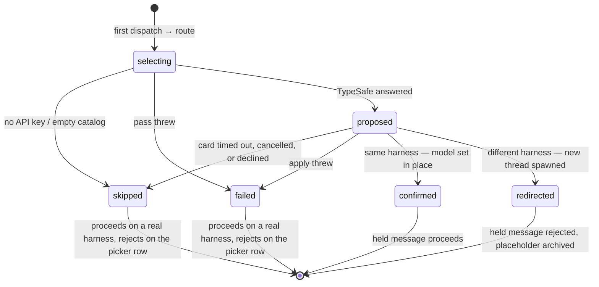

# Dispatch and state

## The hook

`server.ts` installs one handler on `bb.experimental_hooks.on("message.dispatch")`.
Core calls it on every attempt to start or join a turn, with a
`MessageDispatchHookContext` describing the thread (`id`, `status`,
`visibility`, `projectId`, `title`), the attempt (`join-turn` or `start-turn`),
where the thread came from (`origin`, `originPluginId`, `startedOnBehalfOf`),
the execution core has resolved so far (`requestedExecution`,
`executionSources`), the environment or environment intent, the host, and the
message (`input.blocks`, `input.text`).

The handler may answer exactly one of:

| Answer | Effect |
| --- | --- |
| `{ action: "proceed" }` | The attempt continues as if the plugin were not there. |
| `{ action: "wait", reason }` | The message is queued as a row whose `waitingOn` names this plugin and shows `reason`. It stays queued until core is asked to re-decide, the user hits **Send now** (a core bypass that skips the hook), or the orphan sweep clears it because the plugin stopped running. |
| `{ action: "reject", message }` | The attempt is refused and `message` is shown verbatim. |

There is no "I handled it" answer and no way to amend the message or its
execution. A hook is a decision, not an author — which is why a changed
harness has to become a *new* thread.

The handler does three things, in order:

1. Reads the routing record from the thread's plugin metadata. If that read
   throws, it **fails open** on a real harness (`proceed`) and **fails closed**
   on the picker row (`reject`): a router that cannot read its own state must
   not hold a user's message hostage, but it also must not release one onto a
   provider that cannot run it.
2. Gathers the facts and calls `decideDispatch()` from `lib/policy.ts`.
3. Maps the decision to an answer. `route` and `wait` both call `startPass()`
   — `wait` too, because a plugin reload or a server restart drops the
   in-memory pass and any open confirmation card while the metadata still says
   `selecting` or `proposed`. Without that, the row would wait forever.
   Restarting is safe: `startPass` is idempotent per thread.

## The decision

`decideDispatch()` is pure. Its inputs are the facts above plus `enabled` and
`hasApiKey`; its output is `route`, `wait`, `proceed`, or `reject`. The order
matters and is deliberate:

```
1. Terminal routing phases, before anything else — a settled thread is never
   re-examined against settings that may have changed underneath it.
     redirected → reject   ("moved to a new thread; this placeholder is finished")
     confirmed  → proceed
     skipped    → proceed, except the exclude-all case, which rejects
     failed     → proceed

2. Reasons to stay out of the way.
     dispatch is not on the picker row   → proceed  (routing is opt-in, per thread)
     plugin disabled                     → proceed
     no TypeSafe API key                 → proceed
     attempt is join-turn                → proceed  (the harness is already running)
     thread is hidden                    → proceed  (no user to confirm with)
     startedOnBehalfOf is set            → proceed  (an agent or the system chose deliberately)
     another plugin spawned the thread   → proceed  (it carries its own intent)
     thread is not pending               → proceed  (not the first message)

3. A first message.
     phase selecting → wait  "TypeSafe is selecting the right harness and model."
     phase proposed  → wait  "TypeSafe proposed a harness and model — confirm to start."
     otherwise       → route (same reason as selecting)
```

The first line of group 2 is what makes routing opt-in: a thread started on
Codex, Claude, or any other harness proceeds before anything else is
considered, even with a stale `selecting` or `proposed` record on it. Every
reason after it therefore only ever fires for a dispatch on the picker row —
where the wrapper below turns it into a readable rejection.

Then the wrapper: **if the result is `proceed` and the dispatch would run on
the picker row, it becomes `reject`** with a message that says why the thread
never got a harness (the `why` from the branch above — "no TypeSafe API key",
"skipped: declined by the user", …) and what to do instead. This is applied
over the decision, not inside it, so no branch can leak a turn onto the row.

`lib/policy.test.ts` has a table asserting that every pass-through reason
proceeds on a real harness and rejects on the picker row.

## The routing record

The durable state is one JSON object in the thread's plugin metadata under
`routing`:

```ts
interface RoutingRecord {
  phase: "selecting" | "proposed" | "confirmed" | "redirected" | "skipped" | "failed";
  providerId: string | null;          // the proposal's harness, once there is one
  model: string | null;
  replacementThreadId: string | null; // set only in redirected
  detail: string | null;              // cause, for skipped / failed
  updatedAt: number;
}
```

Thread plugin metadata is writable by anything with thread access, so the
record is **parsed, never trusted**: `parseRoutingRecord()` returns `null` for
anything malformed, and a null record routes again rather than wedging the
thread.



A replacement thread is spawned **with its record already `confirmed`**
(`detail: "routed from <placeholder id>"`), so its own first dispatch passes
straight through the same hook without a second routing pass.

Every write to the record also publishes `{ threadId, phase }` on the realtime
channel `routing-changed`, which is how the composer banner stays current
without polling.

## The pass, step by step

`runPass()` in `server.ts`. Each step that ends the pass early calls
`settle(threadId, phase, detail)`, which writes the record and triggers a
recheck.

1. Write `selecting`.
2. Read the API key **now**, not at load — a key set a moment ago applies to
   this pass. Missing → `skipped`, "no TypeSafe API key".
3. Load the catalog for the thread's host with the current preferences (see
   [The routing pass](routing-pass.md)). Empty → `skipped` with a detail that
   distinguishes "no harness on this machine can run a turn" from "every
   available harness is switched off in this plugin's settings". The second is
   fixable in ten seconds by the person reading it, and is the one case where
   `skipped` rejects even on a real harness — releasing the message would
   silently ignore a setting the user just made.
4. `routeFirstMessage()` — the three Choice calls.
5. Write `proposed`, remember display names, and open the confirmation card
   with `bb.ui.requestInput` (renderer `typesafe-confirm`, ten-minute timeout).
6. Outcome not `submitted` (timeout, cancel) → `skipped`, "confirmation
   &lt;outcome&gt;". Submitted without `accept: true` → `skipped`, "declined by
   the user".
7. Read the card's `reasoningLevel`; accept it only if it is on the chosen
   model's ladder, otherwise use what the router proposed. A stale or tampered
   payload cannot pick an effort the model does not have.
8. `apply()`: refuse if the harness is somehow the picker row; compute the
   carried execution; then either update in place and write `confirmed`, or
   spawn, write `redirected`, publish, recheck, and archive the placeholder.
   An archive failure is logged and ignored — the user has already been moved.

Any throw anywhere in the pass is caught, logged, and written as `failed` with
the message, so the held row is re-decided rather than left waiting.

## Failure and restart behaviour

| Situation | What happens |
| --- | --- |
| Plugin reloaded mid-pass | The in-memory pass and any open card are gone; the record still says `selecting`/`proposed`. The next dispatch attempt (core re-attempts queued rows) answers `wait` and restarts the pass. If the record was `proposed`, the user sees the card again. |
| Server restart | Same as above. |
| TypeSafe unreachable or errors | Caught → `failed` → the held message proceeds on a real harness or is rejected with the reason on the picker row. |
| Confirmation card times out (10 min) | `skipped`, "confirmation timeout". Same consequences as `failed`. |
| Metadata unreadable | Fail open on a real harness, fail closed on the picker row (see above). |
| User hits **Send now** on the queued row | Core bypasses the hook by design. On a real harness the message goes out as-is. On the picker row there is no harness, so the bridge's `turn/start` refusal is what the user sees. The README's troubleshooting section covers the message. |
| Two dispatch attempts race during a pass | `inFlight` makes `startPass` a no-op for the second; both answer `wait`. |
